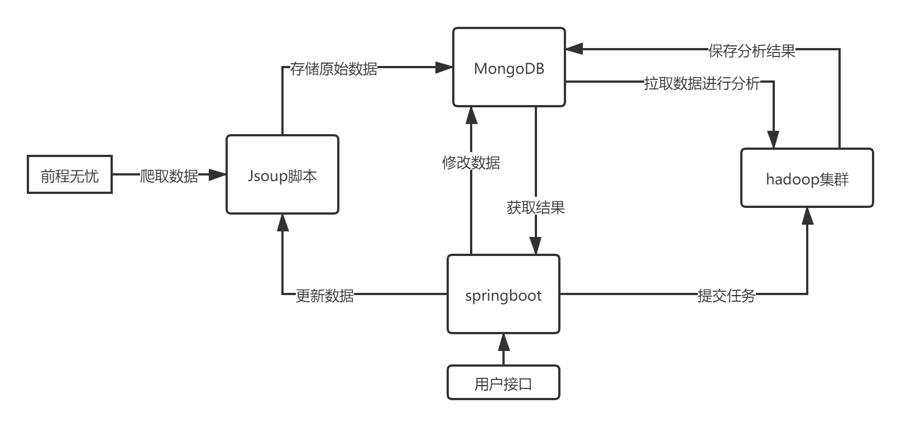
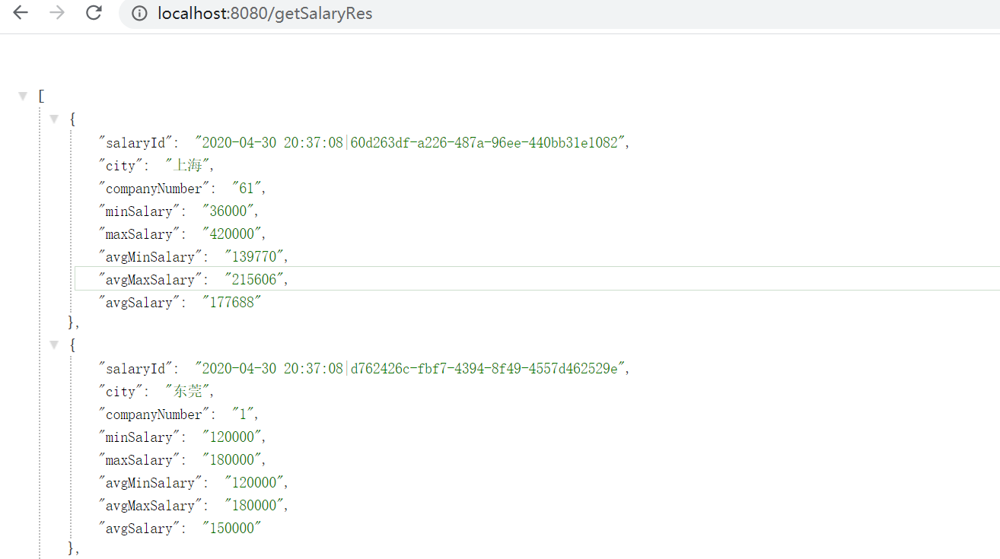
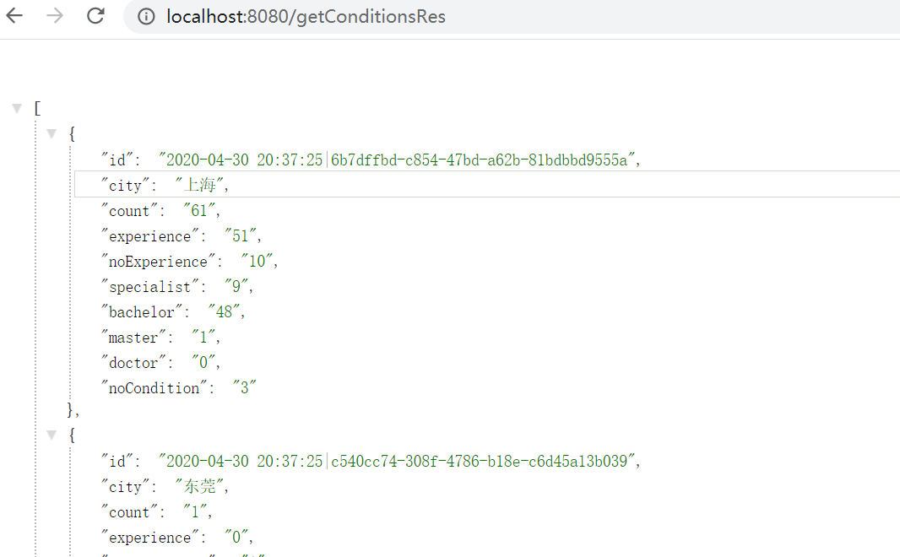

# javaJob-demo
一个简单的大数据demo，主要学习Hadoop与MongoDB
# 背景 
学习分布式与云计算这门课后,想把整门课的知识串一下，并结合已学的java内容，通过简单的Jsoup脚本，爬取[前程无忧](https://www.51job.com/)网站上与java招聘相关的数据进行简单的分析，

根据不同城市或全国范围内，提供以下功能：

1. 简单的招聘信息查看
2. 薪资统计分析（每个城市/全国 的最高/低工资,平均工资，平均最高/低工资）
3. 招聘总数统计（每个城市有java招聘需求的岗位数目）
4. 招聘条件统计分析(不同学位要求与经验要求)

# 主要使用的技术与框架

**Jsoup+SpringBoot+Hadoop+MongDB**

部署环境：centos7+docker

架构：

# 演示效果

工资统计分析

条件统计分析

